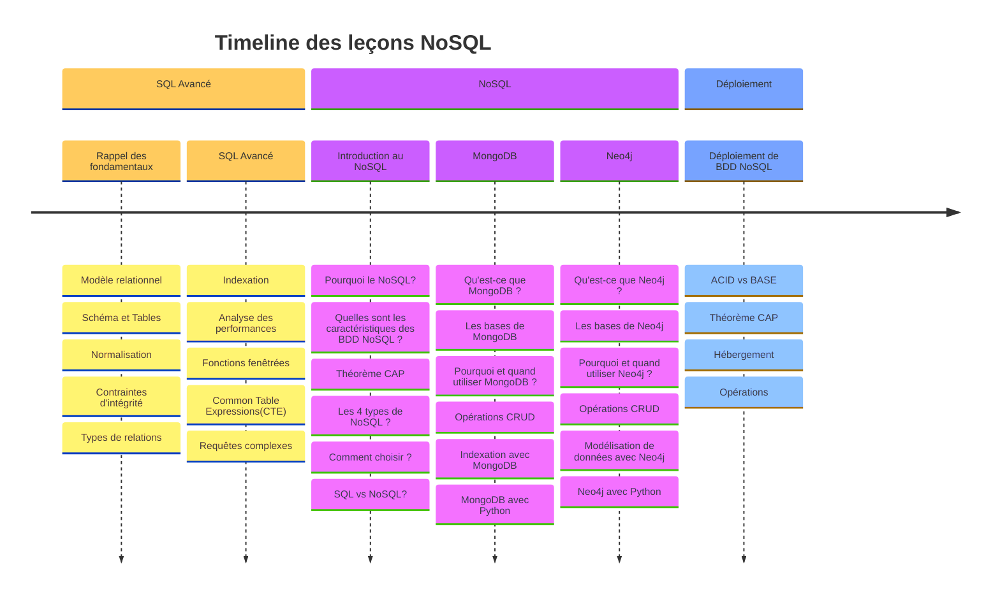

```mermaid
%%{
    init: {
        'logLevel': 'debug',
        'theme': 'base'
    }
}%%
timeline
    title Timeline des leçons NoSQL
    section SQL Avancé
        Rappel des fondamentaux
            : Modèle relationnel
            : Schéma et Tables
            : Normalisation
            : Contraintes d'intégrité
            : Types de relations
        SQL Avancé
            : Indexation 
            : Analyse des performances
            : Fonctions fenêtrées
            : Common Table Expressions(CTE)
            : Requêtes complexes
    section NoSQL
        Introduction au NoSQL
            : Pourquoi le NoSQL?
            : Quelles sont les caractéristiques des BDD NoSQL ?
            : Théorème CAP
            : Les 4 types de NoSQL ?
            : Comment choisir ?
            : SQL vs NoSQL?
        MongoDB
            : Qu'est-ce que MongoDB ?
            : Les bases de MongoDB
            : Pourquoi et quand utiliser MongoDB ?
            : Opérations CRUD
            : Indexation avec MongoDB
            : MongoDB avec Python
        Neo4j
            : Qu'est-ce que Neo4j ?
            : Les bases de Neo4j
            : Pourquoi et quand utiliser Neo4j ?
            : Opérations CRUD
            : Modélisation de données avec Neo4j
            : Neo4j avec Python
    section Déploiement
        Déploiement de BDD NoSQL
            : ACID vs BASE
            : Théorème CAP
            : Hébergement
            : Opérations
```
